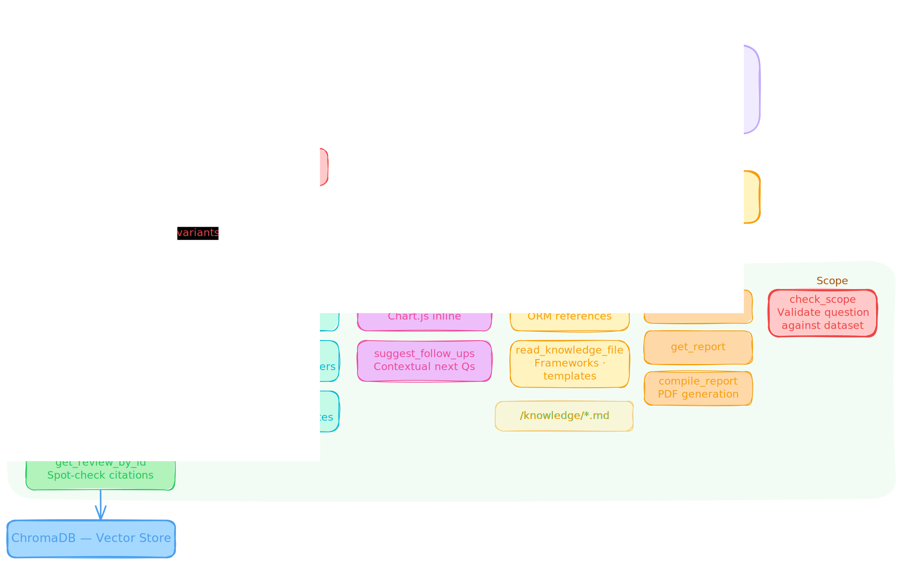
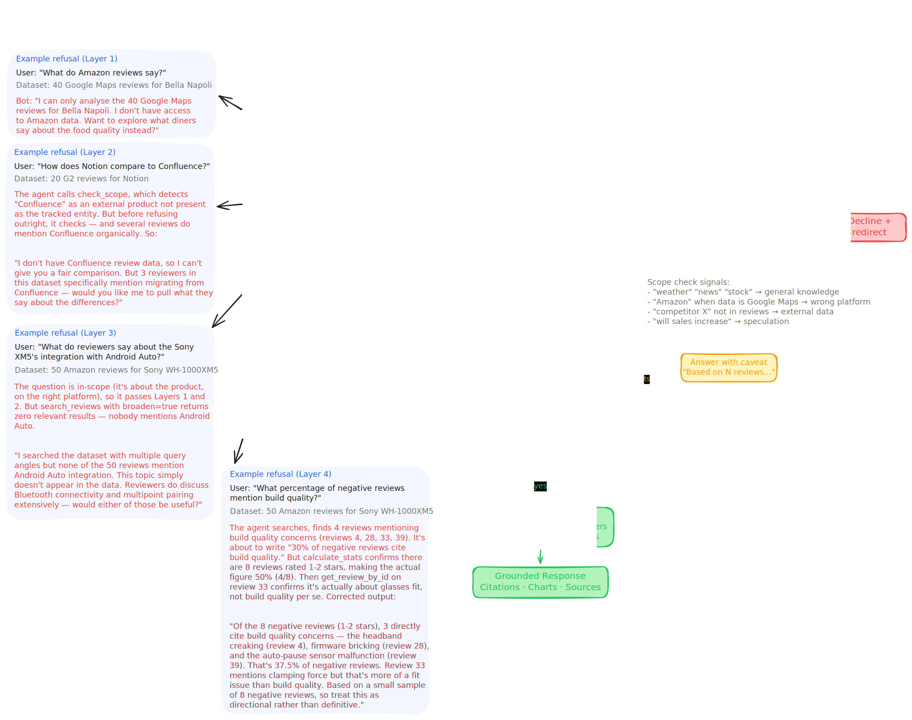

# ReviewLens AI

**Review intelligence analyst**  upload customer reviews, get an instant AI briefing, then interrogate the data through a scope-guarded chat.

Built for the FutureSight take-home assignment.

### [AI Transcripts](https://shaynelarocque.github.io/reviewlens/)

---

## What It Does

1. **Three ingestion paths**  CSV upload, URL scraping (Firecrawl agent v2), or sample data
2. **AI column mapping**  Haiku identifies which columns are review text, rating, date, etc., handling messy CSVs without rigid formatting rules. Detects supplementary columns (pros, cons, title) and concatenates them into the review body for richer semantic search.
3. **Auto-analysis on upload**  reviews get indexed into ChromaDB, Haiku names the workspace, and the agent kicks off an initial intelligence briefing with zero user input. Charts, citations, follow-up suggestions  all generated automatically.
4. **Scope-guarded chat**  every question is validated against the ingested dataset. The agent refuses general knowledge, wrong-platform queries, competitor data, and speculation. Gracefully redirects to what it *can* answer.
5. **PDF report generation**  accumulates findings across the conversation, compiles into a branded PDF with charts, cover page, and citations on explicit request.

---

## Architecture

### System Overview

The frontend is server-rendered (Jinja2 + HTMX) with SSE streaming for real-time tool call visibility. The application layer splits into two FastAPI route groups: chat (SSE-streamed agent responses) and ingestion (upload/scrape/sample). Both feed into a Claude Sonnet 4.6 agent loop via the `claude-agent-sdk`.


### Agent Sandbox

The agent runs in a structured sandbox with a four-quadrant system prompt (Knowledge, Tools, Goal, Guidelines) and a hard scope guard boundary. A context builder passes recent messages in full and compresses older messages into topic summaries. Haiku 4.5 handles query broadening  generating search term variants for deeper coverage.

The MCP tool server exposes six tool categories: Data (search, sentiment, stats, review lookup), Analysis (segment comparison, theme extraction, anomaly detection), Presentation (Chart.js generation, follow-up suggestions), Knowledge (ORM reference files), Report (finding accumulation, PDF compilation), and Scope (dataset validation).



### Scope Guard

The scope guard operates as a four-layer defence, not a single check:

- **Layer 1  System Prompt**: Hard rules catch obvious violations (wrong platform, general knowledge keywords)
- **Layer 2  Ambiguity Check**: Borderline questions get routed to `check_scope`, which validates against dataset metadata (platform, product, review count, keywords)
- **Layer 3  Data Grounding**: `search_reviews` with `broaden=true` runs multiple query variants. If nothing relevant surfaces, the agent says so honestly instead of hallucinating.
- **Layer 4  Self-Correction**: `calculate_stats` confirms numbers before the agent states them. `get_review_by_id` spot-checks that cited reviews actually say what the agent claims. Corrections happen transparently in the analysis timeline.



---

## Key Design Decisions

**Agent, not chain.** This uses the Claude Agent SDK with up to 15 turns per loop and MCP tools  not a linear chain of API calls. The agent decides which tools to call, in what order, and self-corrects when results don't match expectations.

**Broadened search via Haiku.** When `broaden=true`, Haiku generates 3–4 query variants before the main search. Results are deduplicated and merged, giving the agent broader coverage without ham-fisting a single query. Coverage level (strong/moderate/thin) is tracked and surfaced.

**Editable knowledge base.** The `/knowledge/*.md` files contain ORM analytical frameworks, report templates, and analysis patterns. The agent can read these via tools, and users can edit them to improve the system's analytical behaviour without touching code.

**Inline everything.** Charts render inline via Chart.js with `[chart:N]` markers. Citations are clickable popovers showing the full review text, rating, and author. Follow-ups appear as buttons. The analysis timeline (tool calls + thinking) collapses into an accordion. Everything streams in real-time via SSE.

---

## What I'm Most Proud Of

**The scope guard layering.** It's not just "refuse if out of scope"  it's a graduated system where the agent can partially answer borderline questions by pulling what *is* in the data. The Layer 2 example in the scope guard diagram (Notion/Confluence comparison) demonstrates this: the agent can't do a fair comparison, but 3 reviewers mention migrating from Confluence, so it offers to surface those specific perspectives.

**The auto-analysis.** The instant briefing on upload transforms this from a demo into something that feels like a product. An analyst uploads a CSV and immediately gets a structured intelligence briefing with charts, citations, and follow-up paths  no typing required.

---

## What I'd Do With More Time

- **Token-by-token streaming**  currently the full response renders after the agent loop completes. True streaming would make the experience feel more responsive.
- **Freeform canvas with spatial branching**  let analysts branch off analysis threads visually, exploring different aspects in a non-linear spatial layout rather than a linear chat.

---

## Running Locally

```bash
cp .env.example .env
# Add ANTHROPIC_API_KEY (required), FIRECRAWL_API_KEY (optional)

pip install -r requirements.txt
uvicorn app.main:app --reload
```

Or with Docker:

```bash
docker build -t reviewlens .
docker run -p 8000:8000 --env-file .env reviewlens
```

Open `http://localhost:8000`. Load sample data to explore without your own CSV.

---

## Stack

| Layer | Tech |
|-------|------|
| Agent | Claude Sonnet 4.6 via `claude-agent-sdk`, Haiku 4.5 for column mapping + query broadening |
| Backend | FastAPI, SSE streaming, file-based session persistence |
| Vector DB | ChromaDB |
| Frontend | Jinja2 + HTMX + Chart.js + vanilla JS |
| Scraping | Firecrawl Agent v2 (structured extraction) |
| Reports | fpdf2 + matplotlib |
